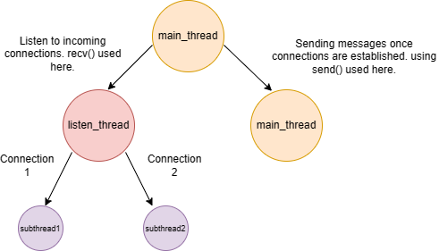

# Cloud_Computing_Project
# Rules used to update the Lamport Clock for events.
* a. newClock=oldClock+1
* b. newClock=max(newClock,oldClock) + 1
## Sender Side
1. Whenever a process requests a critical section, it sends a broadcast request to other 2 processes. The Lamport Clock is updated before sending the broadcast request (rule a).

2. Whenever a process sends a reply to the broadcast request, it updated its Lamport Clock before sending it to the broadcaster (rule a).

3. Whenever a process sends a release message after accessing critical section, its Lamport Clock is updated (rule a).

## Receiver Side
1. Whenever process receives request to access critical section from broadcaster, it updates it Lamport clock according to rule b.

2. Whenever process receives a critical section release message, it updates its Lamport Clock according to rule b.

3. Each time the broadcaster receives a permission from a peer, it updated its Lamport Clock according to rule b.
# Framework Used

## Assumptions
* All the nodes in the network know each other's names, ip-address and port number available for communication prior to starting the simulation.

* While registering oneself and other peers, same order is used for registering.

## Workflow

We employ direct connection between nodes, **without** the requirement for a central server for coordination.

* We use TCP network protocol for establishing connection between nodes.

* Each node spawns a seperated thread for entering into the listening mode, keeping thr main thread for sending messages. Inside the listen mode, a socket is created with a (port+IP) combination to communicate. When the node accepts an incoming connection, it creates a seperate thread again for communication with the concerened peer. This logic can be found in the **listenMode** and **handlePeerConnection** functions.

* The **broadcast** function is the function which is used for both broadcast request and broadcast release messages. When the **broadcast_type** flag is 7, it signifies a node sending broadcast request for accessing the critical section. If it is set to 14, the node sends a broadcast release message after exiting the critical section. We implement the send/outgoing logic in this **broadcast** function, in the main thread itself.
* To identify the type of message in the handlePeerConnection, we use the following code :
1. 0 means the incoming message is broadcast request.
2. 2 means the incoming message is broadcast release.

