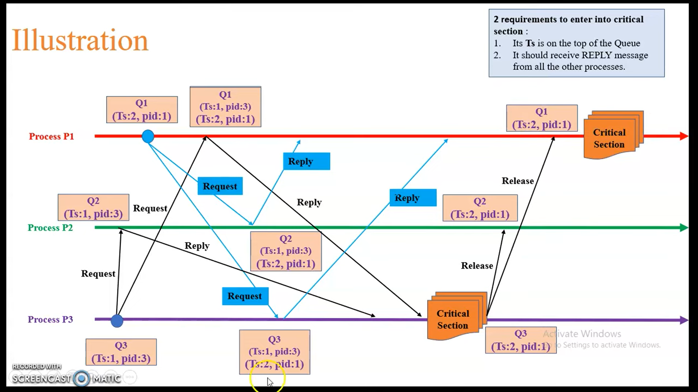
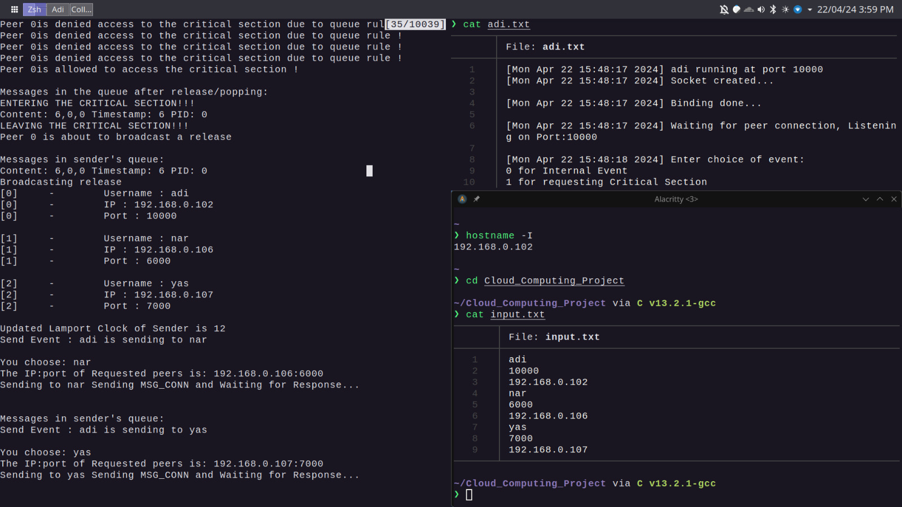
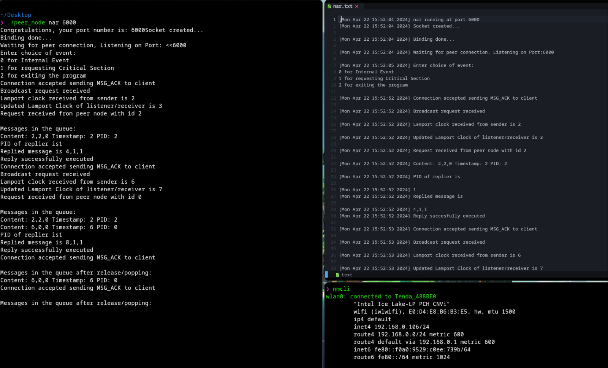
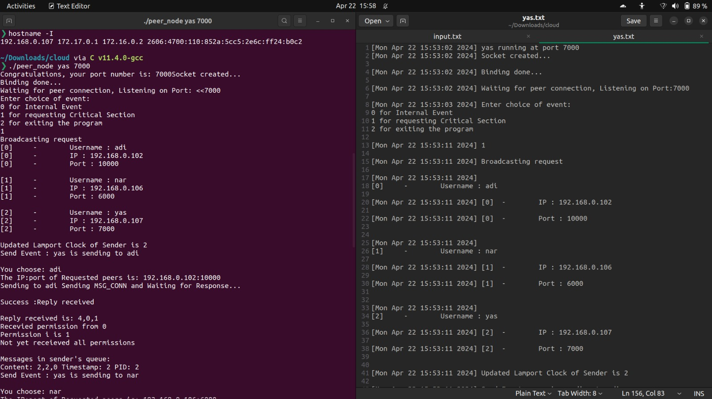

# Steps to simulate the algorithm

After cloning the repo change the permissions of the script using
`chmod +x run.sh`

Then run the script using 
`./run.sh`

This will compile the `peer_node.cpp` program, create an executable `peer_node` and delete previous session's log file.

Run `./peer_node.cpp <username> <port>` where username is your node's username and port is the port used for establishing connections.

The input file `input.txt` contains details about the three nodes in the network and the name given to the executable should be consistent with the input file.

The output is simultaneously displayed on the terminal as well as the log file `<username>.txt` that was created by the executable.

Different devices can be used as the nodes for the network by writing the appropriate IP addresses in the input files.

# Screenshots of Simulation
We simulated the Lamport's Mutual Exclusion for Distributed systems on 3 laptops connected to the same network.

We simulated the below example for 3 devices. Note that P1 corresponds to Device adi, P2 to Device nar and P3 to Device yas. 
0. Example test case

1. Device adi

2. Device nar

3. Device yas
